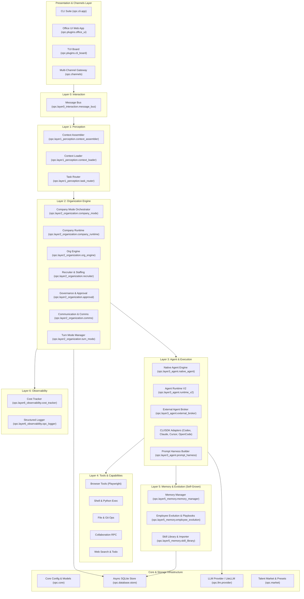
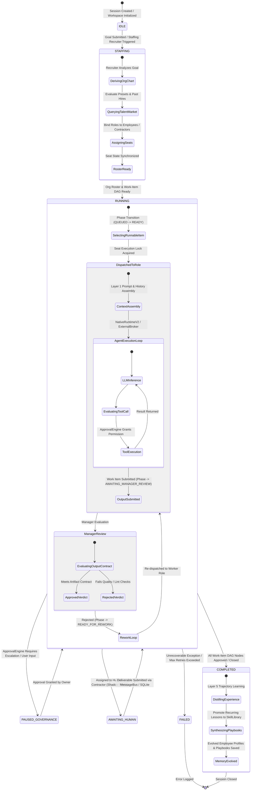
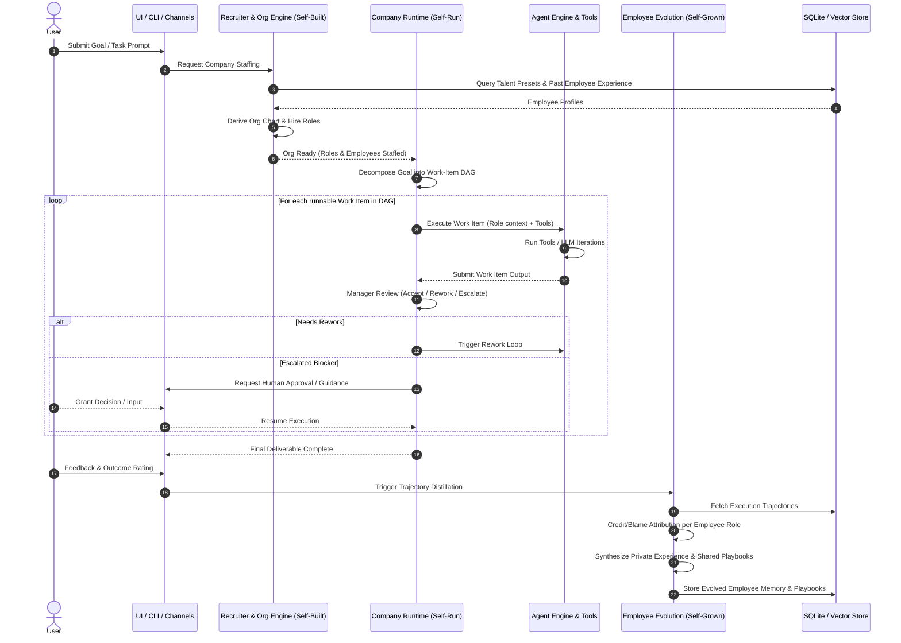
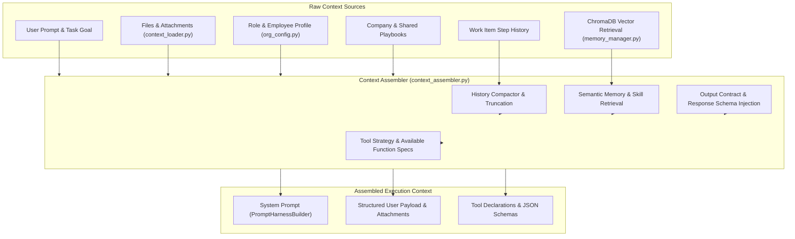
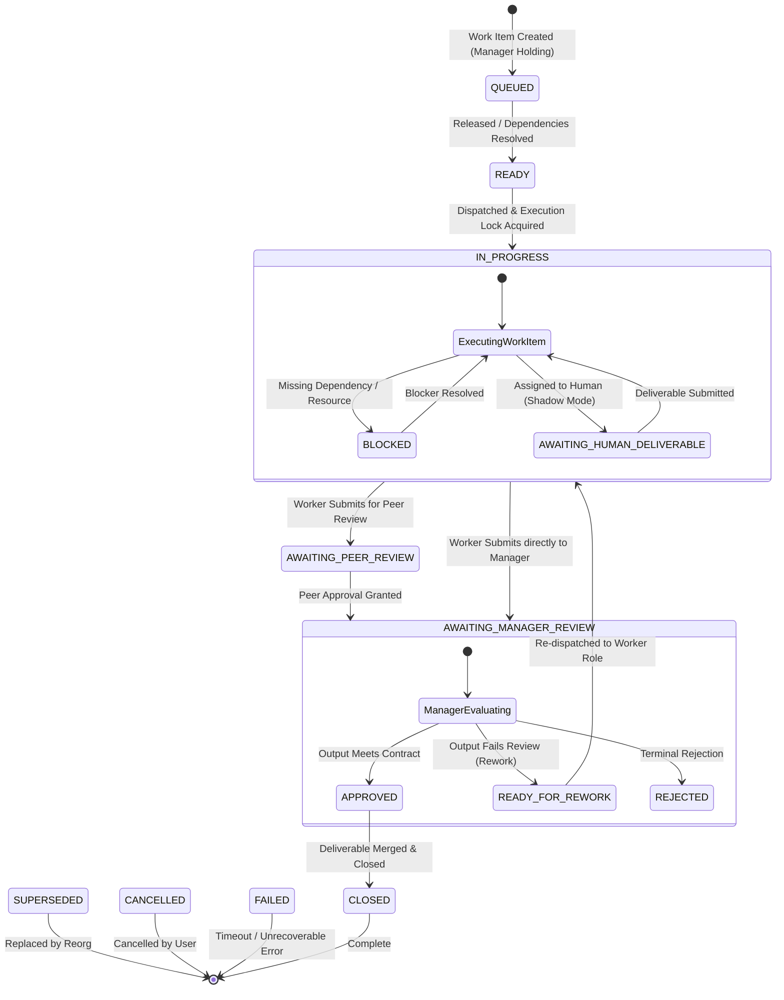
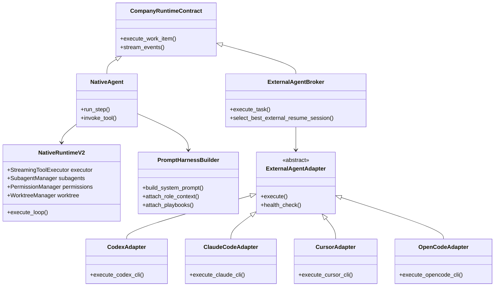
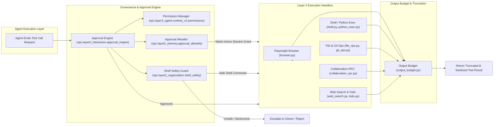
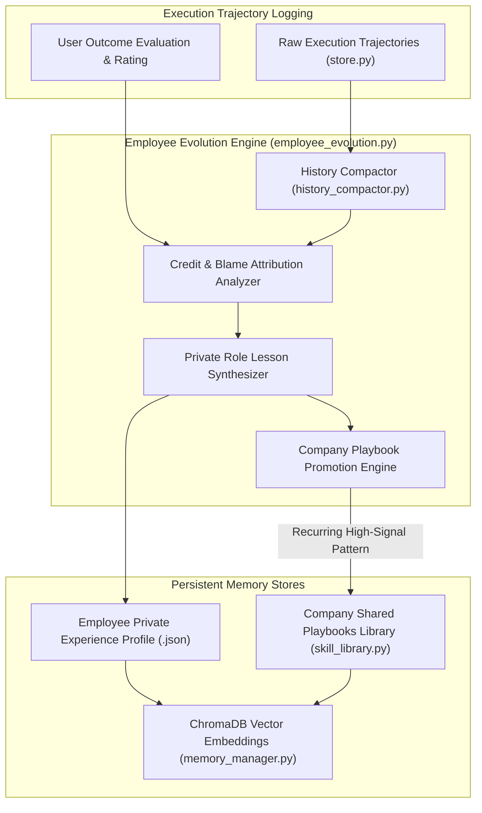
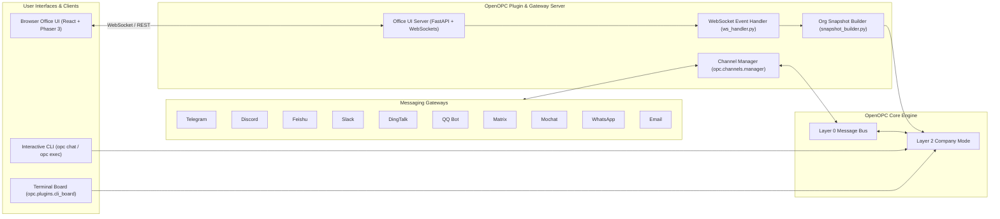
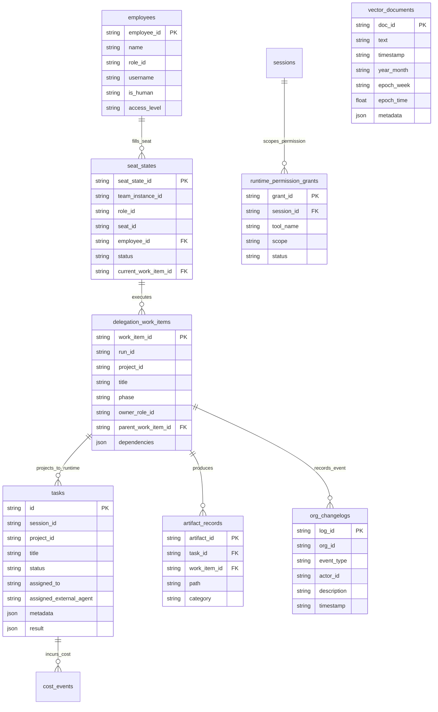

<h1 align="center">OpenOPC Architecture Specification</h1>

  <b>English</b> | <a href="architecture.zh-CN.md">简体中文</a>

Welcome to the **OpenOPC** architecture specification. This document provides an exhaustive, maintainable, and 100% accurate architectural reference for developers and open-source contributors. It details OpenOPC's 7-layer cognitive architecture, global system state flow, perception pipeline, work-item state machine, agent broker adapters, tool governance, memory evolution, persistence model, and real-time presentation topology.

---

## 1. System Architecture Overview

OpenOPC is an autonomous AI agent collaboration framework designed to build, run, and evolve a **One-Person Company (OPC)**. The platform is organized around a **7-Layer Cognitive Architecture** paired with infrastructure modules for persistence, LLM abstractions, talent markets, and user interfaces.

---

## 2. Global System State Flow & Project Lifecycle

The global system lifecycle governs the macro-level state transitions of an OpenOPC project—from initial prompt submission to company staffing, work item DAG execution, governance pauses, deliverable review, and final trajectory learning.

---

## 3. Self-Built, Self-Run, Self-Grown Operational Lifecycle

OpenOPC operates on three self-sustaining feedback loops:

1. **Self-Built (Staffing)**: Translates user goals into role structures and recruits optimal AI employees from talent presets or prior project experience.
2. **Self-Run (Execution)**: Decomposes tasks into dynamic work-item DAGs, assigning ownership and executing through parallel agent sessions with automated review and rework cycles.
3. **Self-Grown (Learning)**: Attributes project results to individual roles, distills raw interaction trajectories into private role experiences, and promotes recurring patterns to company-wide playbooks.

---

## 4. Layer 1: Perception & Context Assembly Architecture

Layer 1 (`opc/layer1_perception/`) prepares the complete context required for agent decisions before any LLM inference or external CLI invocation.

---

## 5. Layer 2: Organization Engine & Work-Item State Machine

The Organization Engine (`opc/layer2_organization/`) manages dynamic work-item orchestration. Each work item progresses through a strict state machine with defined ownership transitions.

### Collaboration Modes

The Manager Role delegates and coordinates work across five distinct operational modes:
- **`execute`**: Direct execution of single-step tasks by an individual agent.
- **`delegate`**: Breakdown and assignment of work items to subordinate role agents.
- **`review`**: Evaluation of submitted work items against defined acceptance criteria.
- **`integrate`**: Combination of sub-task outputs into a cohesive final deliverable.
- **`rework`**: Targeted re-assignment with specific correction guidelines following rejection.

---

## 6. Layer 3: Agent Execution & External Broker Adapters

Layer 3 (`opc/layer3_agent/`) decouples task execution from specific LLM vendors or CLI tools. Tasks can run natively via OpenOPC's `NativeAgent` / `NativeRuntimeV2` engine or be delegated to external coding agents via `ExternalAgentBroker`.

---

## 7. Layer 4: Tool Execution Engine & Governance Pipeline

Layer 4 (`opc/layer4_tools/`) provides executable capabilities. Every tool invocation passes through a multi-tier safety pipeline before reaching execution handlers.

---

## 8. Layer 5: Memory Evolution & Playbook Promotion Mechanism

Layer 5 (`opc/layer5_memory/`) drives the **Self-Grown** loop, transforming raw execution traces into role-specific knowledge and company-wide playbooks.

---

## 9. Real-Time Office UI & Multi-Channel Synchronization Topology

OpenOPC provides a real-time web workspace (Office UI) powered by FastAPI and WebSockets, alongside multi-channel messaging integrations.

---

## 10. Data Model & Persistence Architecture

OpenOPC utilizes asynchronous SQLite (`aiosqlite`) for structured entity storage alongside ChromaDB vector storage for role memory.

---

## 11. Module & Directory Map Reference

| Directory / Package | Layer / Scope | Primary Responsibility | Key Files |
| :--- | :--- | :--- | :--- |
| [`opc/core/`](../opc/core) | Core | Data models, configuration schemas, active task trackers, and runtime envelopes. | [`config.py`](../opc/core/config.py), [`models.py`](../opc/core/models.py), [`employee_registry.py`](../opc/core/employee_registry.py) |
| [`opc/layer0_interaction/`](../opc/layer0_interaction) | Layer 0 | System event message bus and interaction decoupling. | [`message_bus.py`](../opc/layer0_interaction/message_bus.py) |
| [`opc/layer1_perception/`](../opc/layer1_perception) | Layer 1 | Context assembly, document loading, and task intent routing. | [`context_assembler.py`](../opc/layer1_perception/context_assembler.py), [`context_loader.py`](../opc/layer1_perception/context_loader.py) |
| [`opc/layer2_organization/`](../opc/layer2_organization) | Layer 2 | Company Mode orchestration, org engine, recruiter, work-item DAG state machine, and governance. | [`company_mode.py`](../opc/layer2_organization/company_mode.py), [`company_runtime.py`](../opc/layer2_organization/company_runtime.py), [`recruiter.py`](../opc/layer2_organization/recruiter.py), [`approval.py`](../opc/layer2_organization/approval.py) |
| [`opc/layer3_agent/`](../opc/layer3_agent) | Layer 3 | Native execution engine, Runtime V2, external agent broker, adapters (Codex, Claude, Cursor, OpenCode), and prompt builder. | [`native_agent.py`](../opc/layer3_agent/native_agent.py), [`external_broker.py`](../opc/layer3_agent/external_broker.py), [`adapters/`](../opc/layer3_agent/adapters) |
| [`opc/layer4_tools/`](../opc/layer4_tools) | Layer 4 | Executable capabilities including Playwright browser, shell execution, file ops, web search, todo, and collaboration RPC. | [`browser.py`](../opc/layer4_tools/browser.py), [`shell.py`](../opc/layer4_tools/shell.py), [`collaboration.py`](../opc/layer4_tools/collaboration.py) |
| [`opc/layer5_memory/`](../opc/layer5_memory) | Layer 5 | Vector/Markdown memory, trajectory distillation, credit attribution, private role experience, and shared playbooks. | [`memory_manager.py`](../opc/layer5_memory/memory_manager.py), [`employee_evolution.py`](../opc/layer5_memory/employee_evolution.py), [`skill_library.py`](../opc/layer5_memory/skill_library.py) |
| [`opc/layer6_observability/`](../opc/layer6_observability) | Layer 6 | Token cost monitoring and structured logging engine. | [`cost_tracker.py`](../opc/layer6_observability/cost_tracker.py), [`opc_logger.py`](../opc/layer6_observability/opc_logger.py) |
| [`opc/cli/`](../opc/cli) | Interface | Typer-based CLI interface suite (`opc init`, `opc chat`, `opc ui`, `opc exec`). | [`app.py`](../opc/cli/app.py) |
| [`opc/channels/`](../opc/channels) | Gateway | Multi-channel communication adapters (Telegram, Discord, Feishu, Slack, DingTalk, Matrix, etc.). | [`manager.py`](../opc/channels/manager.py), [`base.py`](../opc/channels/base.py) |
| [`opc/database/`](../opc/database) | Persistence | Asynchronous SQLite relational persistence store. | [`store.py`](../opc/database/store.py) |
| [`opc/llm/`](../opc/llm) | LLM | Unified LiteLLM integration layer with multi-provider retry and fallback. | [`provider.py`](../opc/llm/provider.py), [`retry.py`](../opc/llm/retry.py) |
| [`opc/market/`](../opc/market) | Marketplace | Talent presets, company architecture presets, package import/export, and sandbox validation. | [`architecture_registry.py`](../opc/market/architecture_registry.py), [`talent_presets.py`](../opc/market/talent_presets.py) |
| [`opc/plugins/office_ui/`](../opc/plugins/office_ui) | Interface | FastAPI web backend server, WebSocket event engine, Phaser 3 Office visualization, and React Workspace. | [`server.py`](../opc/plugins/office_ui/server.py), [`ws_handler.py`](../opc/plugins/office_ui/ws_handler.py), [`snapshot_builder.py`](../opc/plugins/office_ui/snapshot_builder.py) |

---

## 12. Contributor Implementation Guidelines

When contributing new capabilities to OpenOPC:
1. **Adding a New Tool**: Register the tool definition in [`opc/layer4_tools/registry.py`](../opc/layer4_tools/registry.py) and implement the handler in [`opc/layer4_tools/`](../opc/layer4_tools).
2. **Adding an External Agent Adapter**: Subclass `BaseAgentAdapter` in [`opc/layer3_agent/adapters/base.py`](../opc/layer3_agent/adapters/base.py) and register it in [`opc/layer3_agent/adapters/registry.py`](../opc/layer3_agent/adapters/registry.py).
3. **Adding a Channel Provider**: Subclass `BaseChannelProvider` in [`opc/channels/provider_base.py`](../opc/channels/provider_base.py) and register in [`opc/channels/provider_registry.py`](../opc/channels/provider_registry.py).
4. **Modifying Governance / Approvals**: Update policy logic in [`opc/layer2_organization/approval.py`](../opc/layer2_organization/approval.py).
