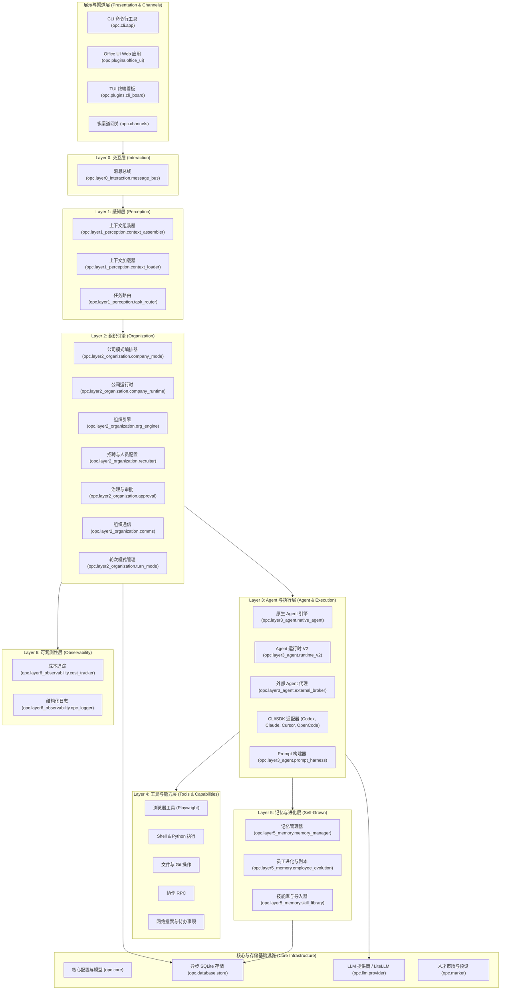
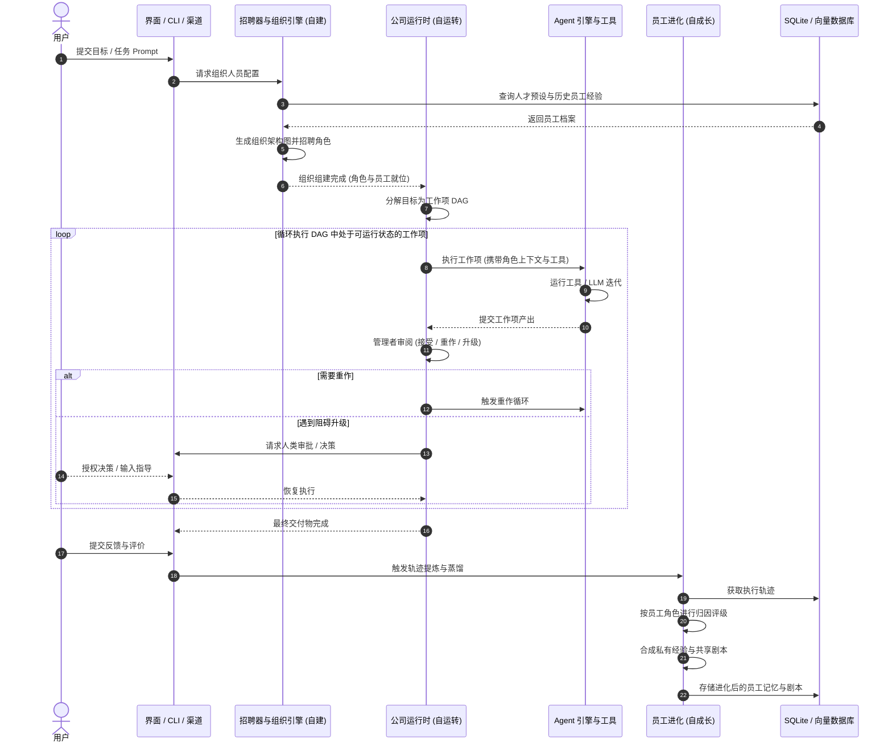
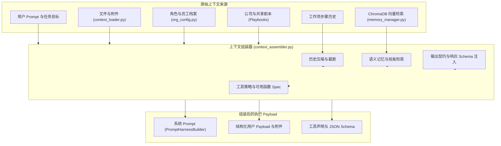
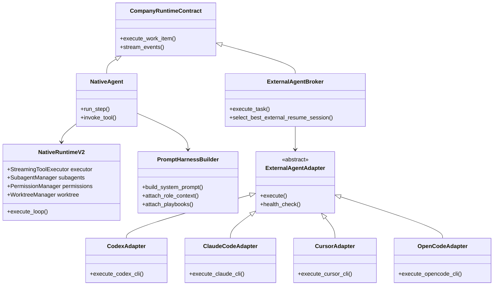
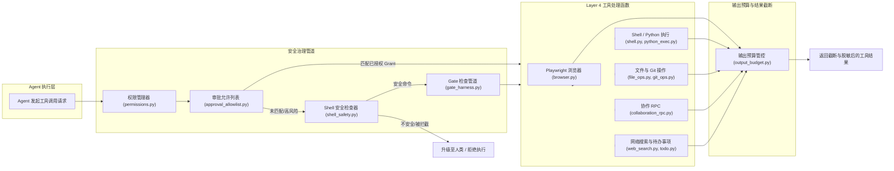
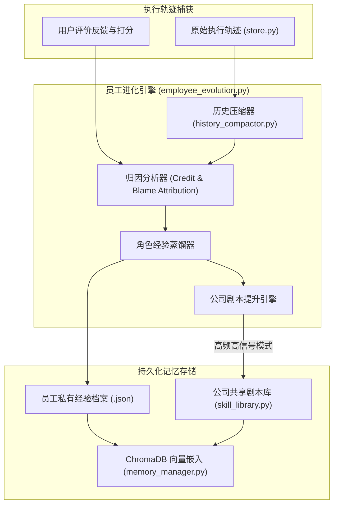
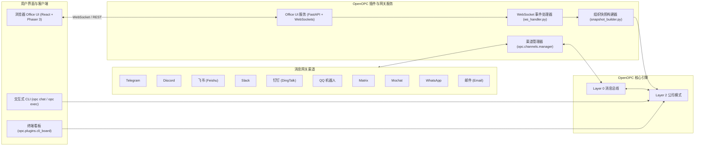
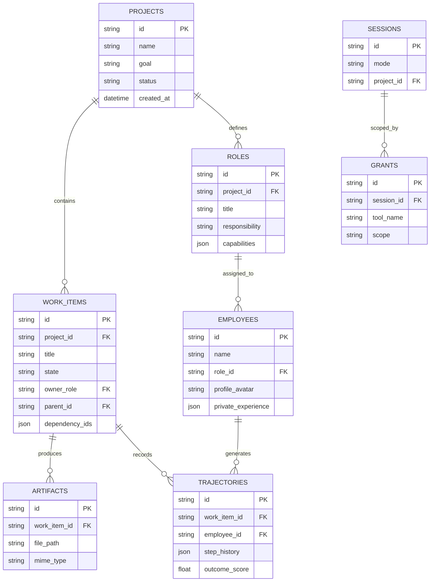

<h1 align="center">OpenOPC 系统架构规范</h1>

<p align="center">
  <a href="architecture.md">English</a> | <b>简体中文</b>
</p>

欢迎阅读 **OpenOPC** 系统架构文档。本文档为开发者和开源贡献者提供完整、结构化且易于维护的架构参考，详细介绍了 OpenOPC 的 7 层认知架构、全局系统状态流、感知管道、工作项状态机、Agent 代理适配器、工具治理管道、记忆进化机制、持久化模型以及多渠道交互接口。

---

## 1. 系统架构总览 (System Architecture Overview)

OpenOPC 是一个专为构建、运行与演进**一人公司 (One-Person Company, OPC)** 打造的自主 AI Agent 协作框架。平台核心基于 **7 层认知架构 (7-Layer Cognitive Architecture)**，并辅以持久化存储、LLM 抽象层、人才市场及多端用户界面等基础设施模块。



---

## 2. 全局系统状态流与项目生命周期 (Global System State Flow)

全局系统生命周期管理着 OpenOPC 项目的宏观状态转换 — 从初始 Prompt 提交到公司人员招聘、工作项 DAG 动态执行、治理中断审批、交付物审阅以及最终轨迹蒸馏。

```mermaid
stateDiagram-v2
    [*] --> UNINITIALIZED : 系统启动 / 加载工作区

    UNINITIALIZED --> CONFIGURING : opc init / 选择预设
    CONFIGURING --> STAFFING : 提交目标 (自建阶段)

    state STAFFING {
        [*] --> DerivingOrgChart : 推导组织架构图
        DerivingOrgChart --> QueryingTalentMarket : 评估预设与历史雇员
        QueryingTalentMarket --> HiringEmployees : 角色与员工匹配招聘
        HiringEmployees --> OrgStaffed : 团队花名册组建完成
    }

    STAFFING --> ORCHESTRATING : 组织花名册就位

    state ORCHESTRATING {
        [*] --> DecomposingGoal : 组织引擎生成工作项 DAG
        DecomposingGoal --> SchedulingDAG : 解析工作项前置依赖
        SchedulingDAG --> DispatchingWorkItem : 抽取可运行工作项
    }

    ORCHESTRATING --> EXECUTING_ITEM : 工作项分发至执行角色

    state EXECUTING_ITEM {
        [*] --> AssemblingContext : Layer 1 上下文组装
        AssemblingContext --> AgentLoop : NativeAgent / ExternalBroker 迭代
        
        state AgentLoop {
            [*] --> LLMInference : LLM 推理
            LLMInference --> EvaluatingToolCall : 校验工具调用
            EvaluatingToolCall --> ExecutingTool : 治理审批通过并执行工具
            ExecutingTool --> LLMInference : 附加工具执行结果
        }

        AgentLoop --> AWAITING_HUMAN_APPROVAL : 高风险操作 / 运行阻碍
        AWAITING_HUMAN_APPROVAL --> AgentLoop : 人类授权决策 / 输入指导
        AgentLoop --> SubmittingOutput : 生成工作项产出
    }

    EXECUTING_ITEM --> IN_MANAGER_REVIEW : 执行角色提交工作项

    state IN_MANAGER_REVIEW {
        [*] --> ReviewingDeliverable : 审阅交付物
        ReviewingDeliverable --> Accepted : 满足输出契约要求
        ReviewingDeliverable --> Rejected : 未达验收标准
    }

    IN_MANAGER_REVIEW --> REWORKING : 已拒绝并附带修改建议 (Reworking)
    REWORKING --> EXECUTING_ITEM : 重新分发至执行角色

    IN_MANAGER_REVIEW --> ORCHESTRATING : 已接受 (DAG 中仍有待执行工作项)
    IN_MANAGER_REVIEW --> PROJECT_COMPLETE : 已接受 (DAG 中所有工作项均已完成)

    state PROJECT_COMPLETE {
        [*] --> GeneratingFinalReport : 生成最终报告
        GeneratingFinalReport --> DistillingTrajectories : 自成长阶段
        
        state DistillingTrajectories {
            [*] --> RatingOutcomes : 解析用户评价反馈
            RatingOutcomes --> AttributingCredit : 角色归因评级
            AttributingCredit --> UpdatingPrivateExperience : 更新角色私有经验
            UpdatingPrivateExperience --> SynthesizingPlaybooks : 提升高频经验模式
        }

        DistillingTrajectories --> MemoryEvolved : 共享公司剧本库已更新
    }

    PROJECT_COMPLETE --> [*] : 项目归档 / 空闲
```



---

## 3. 自建、自运转、自成长运行生命周期 (Operational Lifecycle)

OpenOPC 围绕三大自我驱动的反哺闭环运行：

1. **自建 (Self-Built - 组织配置)**: 将用户目标转化为组织架构与角色定义，并从人才预设或历史项目积累中招聘最匹配的 AI 员工。
2. **自运转 (Self-Run - 任务执行)**: 将复杂任务拆解为动态工作项 DAG (有向无环图)，分配负责人并在并行 Agent 会话中自动执行审阅与重作循环。
3. **自成长 (Self-Grown - 经验学习)**: 将项目交付结果归因至具体角色，提取原始交互轨迹为角色私有经验，并将复用模式提升为全公司共享剧本 (Playbook)。



---

## 4. Layer 1: 感知与上下文组装架构 (Perception & Context Assembly)

Layer 1 (`opc/layer1_perception/`) 在任何 LLM 推理或外部 CLI 调用前，负责准备 Agent 决策所需的完整上下文。



---

## 5. Layer 2: 组织引擎与工作项状态机 (Work-Item State Machine)

组织引擎 (`opc/layer2_organization/`) 负责管理动态工作项编排。每个工作项遵循严格的状态机进行流转与所有权交接。

```mermaid
stateDiagram-v2
    [*] --> PENDING : 工作项已创建 (Pending)

    PENDING --> READY : 前置依赖已解决 (Ready)
    READY --> RUNNING : 已分配角色并分发 (Running)

    state RUNNING {
        [*] --> Executing : 执行中
        Executing --> AWAITING_HUMAN_DELIVERABLE : 人类外包角色交接 (Shadow Mode)
        AWAITING_HUMAN_DELIVERABLE --> Executing : 通过 Layer 0 事件完成交付
        Executing --> WaitingApproval : 触发破坏性/高风险操作
        WaitingApproval --> Executing : 审批通过
        Executing --> Blocked : 遇到运行阻碍/缺少信息
        Blocked --> Executing : 阻碍已解除
    }

    RUNNING --> IN_REVIEW : 执行角色提交任务 (In Review)
    RUNNING --> ESCALATED : 严重失败 / 权限超限 (Escalated)

    state IN_REVIEW {
        [*] --> Reviewing : 审阅中
        Reviewing --> Accepted : 管理者批准交付物
        Reviewing --> Rejected : 未达输出契约要求
    }

    IN_REVIEW --> COMPLETED : 已接受 (Completed)
    IN_REVIEW --> RUNNING : 重新分发至执行角色
    ESCALATED --> RUNNING : 由人类所有者/管理者解决
    COMPLETED --> [*]

---

## 5.1. 暗影模式与去中心化人类节点架构 (Shadow Mode & Human Nodes)

OpenOPC 支持 **暗影模式 (Shadow Mode)**，允许将下属角色交由真实人类外包人员完成，作为 CompanyRuntime DAG 中的去中心化计算节点。

```mermaid
sequenceDiagram
    autonumber
    participant Engine as CompanyRuntime (Layer 2)
    participant Adapter as HumanAgentAdapter (Layer 3)
    participant Bus as MessageBus (Layer 0)
    participant Store as OPCStore / SQLite (Database)
    participant Portal as Streamlit Web 门户 (Presentation)
    participant Human as 人类承包商 (Human Node)

    Engine->>Adapter: execute(task, context)
    Adapter->>Store: save_task(status="RUNNING", sub_state="AWAITING_HUMAN_DELIVERABLE")
    Adapter->>Bus: subscribe_once("deliverable_completed:{task_id}")
    Note over Adapter: 适配器原生阻塞 (零轮询)

    Human->>Portal: 身份验证 (JWT / PBKDF2)
    Portal->>Human: 渲染分配的工作项
    Human->>Portal: 上传交付文件 / 总结
    Portal->>Store: save_trajectory() & log_org_changelog()
    Portal->>Bus: publish_event("deliverable_completed:{task_id}", payload)
    Bus-->>Adapter: 事件触发 (解除 subscribe_once 阻塞)
    Adapter-->>Engine: 返回任务完成 Payload
```

---

## 5.2. 时空组织知识与性能追踪器 (Temporal Knowledge & Performance Tracker)

**时空组织知识与性能追踪器** 将 OpenOPC 升级为具有时间感知的组织变更日志与性能分析平台：

1. **时间感知向量元数据 (`opc.layer5_memory.memory_manager`)**:
   - 在向量文档嵌入中严格注入 `timestamp`, `year_month`, `epoch_week`, 与 `epoch_time`。
   - 提供 `query_temporal_memory(query, start_date, end_date)` 用于时间跨度历史对比。

2. **统一组织变更日志表 (`ORG_CHANGELOGS`)**:
   - SQLite Schema: `org_changelogs(id, timestamp, event_type, actor_id, description, impact_score, metadata)`.
   - 由 `OPCLogger` 在 DAG 关键节点静默自动写入。

3. **三级关系性能聚合 (`opc.database.store`)**:
   - 按可配置时间间隔 (`weekly` 或 `daily`) 执行 SQL `GROUP BY` 聚合。
   - 在三个层级切片度量指标：`Global` (全组织), `Team` (团队/角色), `Individual` (个人/承包商/AI员工)。

4. **时光机分析仪表盘 (`opc.presentation.human_portal`)**:
   - Streamlit 分析门户，可视化渲染组织速率折线图、团队切片柱状图、个人绩效图表与可搜索变更日志流。
```

### 协作模式 (Collaboration Modes)

管理者角色在以下 5 种不同的模式下协调与分发工作：
- **`execute` (执行)**: 由单个 Agent 直接执行单步任务。
- **`delegate` (委托)**: 拆解并将工作项委派给下属角色 Agent。
- **`review` (审阅)**: 对提交的工作项产出按验收标准进行评估。
- **`integrate` (集成)**: 将各子任务的产出汇总为完整交付物。
- **`rework` (重作)**: 拒绝后附带具体修改建议并重新分发。

---

## 6. Layer 3: Agent 执行与外部代理适配器 (Broker Adapters)

 Layer 3 (`opc/layer3_agent/`) 将任务执行与特定 LLM 厂商或 CLI 工具解耦。任务既可以通过 OpenOPC 的 `NativeAgent` / `NativeRuntimeV2` 原生引擎执行，也可以通过 `ExternalAgentBroker` 委托给外部编程 Agent。



---

## 7. Layer 4: 工具执行引擎与治理管道 (Tool Governance Pipeline)

Layer 4 (`opc/layer4_tools/`) 提供实际的可执行能力。每一次工具调用在进入处理函数之前，必须通过多重安全治理管道。



---

## 8. Layer 5: 记忆进化与剧本提升机制 (Memory Evolution & Playbook Promotion)

Layer 5 (`opc/layer5_memory/`) 驱动 **自成长 (Self-Grown)** 闭环，将原始执行轨迹转化为角色私有知识与全公司共享剧本。



---

## 9. 多渠道与展示层拓扑 (Multi-Channel Topology)

OpenOPC 支持终端交互、实时 Web UI 以及多渠道消息平台接入。



---

## 10. 数据模型与持久化架构 (Persistence Architecture)

OpenOPC 使用异步 SQLite (`aiosqlite`) 存储关系型数据，并结合 ChromaDB 向量数据库存储角色记忆。



---

## 11. 模块与目录对照表 (Module & Directory Map)

| 目录 / 包名 | 图层 / 作用域 | 主要职责 | 关键文件 |
| :--- | :--- | :--- | :--- |
| [`opc/core/`](../opc/core) | 核心层 | 数据模型、配置 Schema、活跃任务追踪与运行时封装。 | [`config.py`](../opc/core/config.py), [`models.py`](../opc/core/models.py), [`employee_registry.py`](../opc/core/employee_registry.py) |
| [`opc/layer0_interaction/`](../opc/layer0_interaction) | Layer 0 | 系统事件消息总线与解耦交互。 | [`message_bus.py`](../opc/layer0_interaction/message_bus.py) |
| [`opc/layer1_perception/`](../opc/layer1_perception) | Layer 1 | 上下文组装、文档加载与任务意图路由。 | [`context_assembler.py`](../opc/layer1_perception/context_assembler.py), [`context_loader.py`](../opc/layer1_perception/context_loader.py) |
| [`opc/layer2_organization/`](../opc/layer2_organization) | Layer 2 | 公司模式编排、组织引擎、招聘、工作项 DAG 状态机及治理策略。 | [`company_mode.py`](../opc/layer2_organization/company_mode.py), [`company_runtime.py`](../opc/layer2_organization/company_runtime.py), [`recruiter.py`](../opc/layer2_organization/recruiter.py), [`approval.py`](../opc/layer2_organization/approval.py) |
| [`opc/layer3_agent/`](../opc/layer3_agent) | Layer 3 | 原生执行引擎、Runtime V2、外部 Agent 代理、适配器 (Codex, Claude, Cursor, OpenCode) 及 Prompt 构建器。 | [`native_agent.py`](../opc/layer3_agent/native_agent.py), [`external_broker.py`](../opc/layer3_agent/external_broker.py), [`adapters/`](../opc/layer3_agent/adapters) |
| [`opc/layer4_tools/`](../opc/layer4_tools) | Layer 4 | 可执行能力集（包括 Playwright 浏览器、Shell 执行、文件操作、Web 搜索、待办事项与协作 RPC）。 | [`browser.py`](../opc/layer4_tools/browser.py), [`shell.py`](../opc/layer4_tools/shell.py), [`collaboration.py`](../opc/layer4_tools/collaboration.py) |
| [`opc/layer5_memory/`](../opc/layer5_memory) | Layer 5 | 向量/Markdown 记忆、轨迹蒸馏、结果归因、角色私有经验与共享剧本。 | [`memory_manager.py`](../opc/layer5_memory/memory_manager.py), [`employee_evolution.py`](../opc/layer5_memory/employee_evolution.py), [`skill_library.py`](../opc/layer5_memory/skill_library.py) |
| [`opc/layer6_observability/`](../opc/layer6_observability) | Layer 6 | Token 成本监控与结构化日志引擎。 | [`cost_tracker.py`](../opc/layer6_observability/cost_tracker.py), [`opc_logger.py`](../opc/layer6_observability/opc_logger.py) |
| [`opc/cli/`](../opc/cli) | 接口层 | Typer CLI 命令行套件 (`opc init`, `opc chat`, `opc ui`, `opc exec`)。 | [`app.py`](../opc/cli/app.py) |
| [`opc/channels/`](../opc/channels) | 网关层 | 多渠道通信适配器（Telegram, Discord, 飞书, Slack, 钉钉, Matrix 等）。 | [`manager.py`](../opc/channels/manager.py), [`base.py`](../opc/channels/base.py) |
| [`opc/database/`](../opc/database) | 持久化 | 异步 SQLite 关系型存储层。 | [`store.py`](../opc/database/store.py) |
| [`opc/llm/`](../opc/llm) | LLM 层 | 统一 LiteLLM 集成层，支持多 Provider 重试与降级机制。 | [`provider.py`](../opc/llm/provider.py), [`retry.py`](../opc/llm/retry.py) |
| [`opc/market/`](../opc/market) | 市场层 | 人才预设、公司架构预设、包导入/导出及沙箱校验。 | [`architecture_registry.py`](../opc/market/architecture_registry.py), [`talent_presets.py`](../opc/market/talent_presets.py) |
| [`opc/plugins/office_ui/`](../opc/plugins/office_ui) | 接口层 | FastAPI 后端服务、WebSocket 事件引擎、Phaser 3 Office 界面与 React 工作区。 | [`server.py`](../opc/plugins/office_ui/server.py), [`ws_handler.py`](../opc/plugins/office_ui/ws_handler.py), [`snapshot_builder.py`](../opc/plugins/office_ui/snapshot_builder.py) |

---

## 12. 开源贡献指南 (Summary for Contributors)

向 OpenOPC 贡献新功能时的指导步骤：
1. **添加新工具**: 在 [`opc/layer4_tools/registry.py`](../opc/layer4_tools/registry.py) 中注册工具定义，并在 [`opc/layer4_tools/`](../opc/layer4_tools) 中实现处理函数。
2. **添加外部 Agent 适配器**: 在 [`opc/layer3_agent/adapters/base.py`](../opc/layer3_agent/adapters/base.py) 中继承 `BaseAgentAdapter`，并在 [`opc/layer3_agent/adapters/registry.py`](../opc/layer3_agent/adapters/registry.py) 中注册。
3. **添加渠道 Provider**: 在 [`opc/channels/provider_base.py`](../opc/channels/provider_base.py) 中继承 `BaseChannelProvider`，并在 [`opc/channels/provider_registry.py`](../opc/channels/provider_registry.py) 中注册。
4. **修改治理 / 审批逻辑**: 在 [`opc/layer2_organization/approval.py`](../opc/layer2_organization/approval.py) 中更新策略逻辑。
